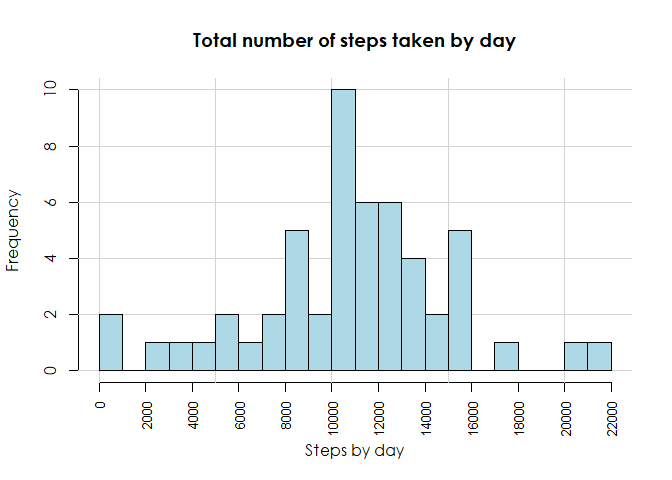
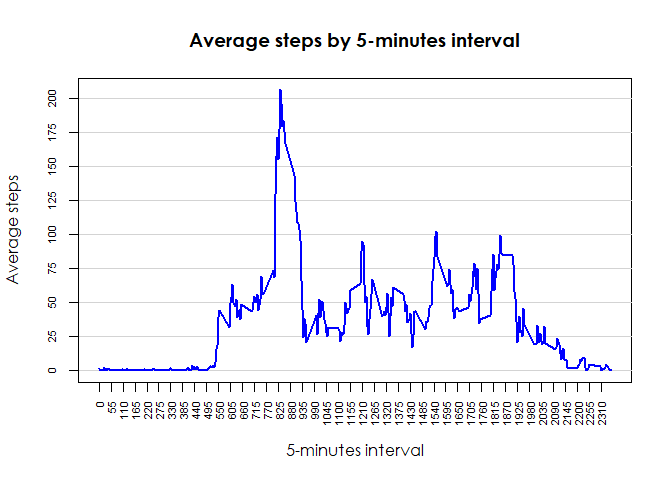
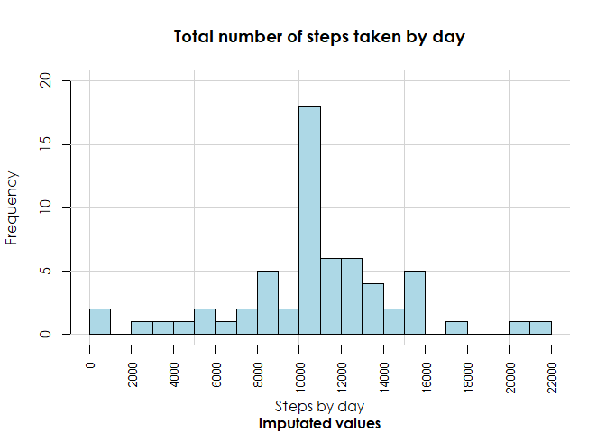
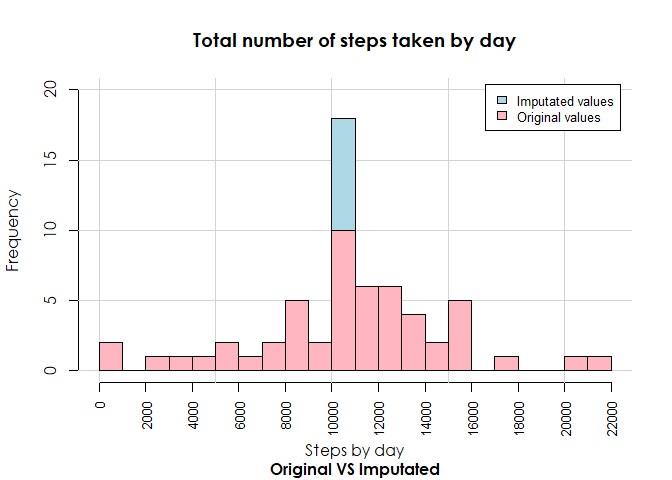
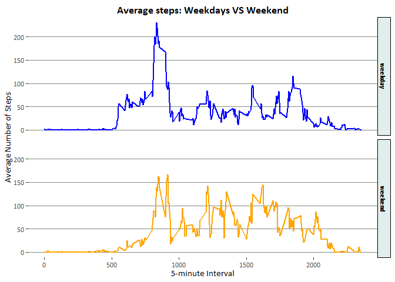

### **Libraries.**

For this assignment, I will use the following libraries to produce plots (`ggplot2` within `tidyverse`), give format to it (`ggThemeAssist`), clean the data (`dplyr` within `tidyverse`) and use windows fonts (`extrafont` and `extrafontdb`).

```r
library(extrafont)
library(extrafontdb)
library(tidyverse)
library(ggThemeAssist)
library(showtext)
```


### **Loading and preprocessing the data.**
This chunk of code will unzip and read the data in `csv` format, as well as show the first rows of the data.

```r
activity <- read.csv(unz('activity.zip',
                         'activity.csv'))
head(activity)
```

```
##   steps       date interval
## 1    NA 2012-10-01        0
## 2    NA 2012-10-01        5
## 3    NA 2012-10-01       10
## 4    NA 2012-10-01       15
## 5    NA 2012-10-01       20
## 6    NA 2012-10-01       25
```


### **What is mean total number of steps taken per day?**

##### 1. Calculate the total number of steps taken per day.\
Using the pipe operator from the `dplyr` package, next code chunk will first group the data by `date`, and then generate the total number of steps by day, using the `summarise` and `sum` functions. We finally just add the argument `.groups` to the function so that the grouping structure is dropped. This can happen by default, but it prevents R from printing unnecessary messages.

```r
steps_byday <- activity %>%
    group_by(date) %>%
    summarise('total steps of the day' = sum(steps),
              .groups = 'drop')
steps_byday
```

```
## # A tibble: 61 x 2
##    date       `total steps of the day`
##    <chr>                         <int>
##  1 2012-10-01                       NA
##  2 2012-10-02                      126
##  3 2012-10-03                    11352
##  4 2012-10-04                    12116
##  5 2012-10-05                    13294
##  6 2012-10-06                    15420
##  7 2012-10-07                    11015
##  8 2012-10-08                       NA
##  9 2012-10-09                    12811
## 10 2012-10-10                     9900
## # ... with 51 more rows
```

##### 2. Make a histogram of the total number of steps taken each day.\
We now create a histogram with customized axes and grid, utilizing R base plotting.

```r
hist(steps_byday$`total steps of the day`,
     breaks = 20,
     main = 'Total number of steps taken by day',
     xlab = 'Steps by day',
     col = 'lightblue',
     xaxt = 'n',
     font.sub = 15,
     font.main = 15,
     font.lab = 14,
     font.axis = 14)
axis(1, at = seq(0, 22000, 2000),
     labels = seq(0, 22000, 2000),
     cex.axis = .8,
     las = 2)
grid(lty = 1)
hist(steps_byday$`total steps of the day`,
     breaks = 20,
     col = 'lightblue',
     add = T)
```



##### 3. Calculate and report the mean and median of the total number of steps taken per day.\
The following will report a summary of our data, including the median and the mean, by calling the `summary` function.

```r
summary(steps_byday)
```

```
##      date           total steps of the day
##  Length:61          Min.   :   41         
##  Class :character   1st Qu.: 8841         
##  Mode  :character   Median :10765         
##                     Mean   :10766         
##                     3rd Qu.:13294         
##                     Max.   :21194         
##                     NA's   :8
```


We can see that 10766 is the mean total number of steps taken each day, while 10765 is the median value.

### **What is the average daily activity pattern?**

##### 1. Make a time series plot (i.e. `type = "l"`) of the 5-minute interval (x-axis) and the average number of steps taken, averaged across all days (y-axis).\


```r
(steps_interval <- activity %>% 
   group_by(interval) %>% 
   summarise('mean' = mean(steps,
                           na.rm = T),
             .groups = 'drop'))
```

```
## # A tibble: 288 x 2
##    interval   mean
##       <int>  <dbl>
##  1        0 1.72  
##  2        5 0.340 
##  3       10 0.132 
##  4       15 0.151 
##  5       20 0.0755
##  6       25 2.09  
##  7       30 0.528 
##  8       35 0.868 
##  9       40 0     
## 10       45 1.47  
## # ... with 278 more rows
```

```r
plot(x = steps_interval$interval,
     y = steps_interval$mean,
     type = 'l',
     xaxt = 'n',
     yaxt = 'n',
     xlab = '5-minutes interval',
     ylab = 'Average steps',
     main = 'Average steps by 5-minutes interval',
     font.sub = 15,
     font.main = 15,
     font.lab = 14,
     font.axis = 14)
abline(h = seq(0,
               max(steps_interval$mean),
               25),
       col = 'lightgrey')
lines(steps_interval$interval,
      steps_interval$mean,
      col = 'blue',
      lwd = 2)
axis(1,
     at = seq(0, max(steps_interval$interval), 55),
     labels = seq(0, max(steps_interval$interval), 55),
     cex.axis = .7,
     las = 2)
axis(2,
     at = seq(0, max(steps_interval$mean), 25),
     labels = seq(0, max(steps_interval$mean), 25),
     cex.axis = .7,
     las = 3)
```



##### 2. Which 5-minute interval, on average across all the days in the dataset, contains the maximum number of steps?\

```r
max.steps <- steps_interval[which.max(steps_interval$mean),]
max.steps
```

```
## # A tibble: 1 x 2
##   interval  mean
##      <int> <dbl>
## 1      835  206.
```
As shown in the last chunk, the 5-minute interval containing the maximum value is 835 with a mean value of 206.1698113.


### **Imputing missing values.**
##### 1. Calculate and report the total number of missing values in the dataset.\
This will report an R `table` where `TRUE` equals all the missing values and `FALSE` the opposite.

```r
missingVals <- is.na(activity$steps)
table(missingVals)
```

```
## missingVals
## FALSE  TRUE 
## 15264  2304
```
##### 2. Devise a strategy for filling in all of the missing values in the dataset.\
I'm going to use the `lapply` function to evaluate all the elements of a `list` that's a product of splitting the `activity` data by `interval`. The function to apply is one that first calculates the mean value of the `steps` column (for each element of the list), and then assign it to all the missing values of the same column. 

```r
activity$NAs <- missingVals
imputated <- lapply(X = split(activity,
                              activity$interval),
                    FUN = function(x) {
                      x$steps[is.na(x$steps)] <- mean(x$steps, na.rm = T)
                      x
                    })
class(imputated)
```

```
## [1] "list"
```

```r
head(imputated[[1]])
```

```
##          steps       date interval   NAs
## 1     1.716981 2012-10-01        0  TRUE
## 289   0.000000 2012-10-02        0 FALSE
## 577   0.000000 2012-10-03        0 FALSE
## 865  47.000000 2012-10-04        0 FALSE
## 1153  0.000000 2012-10-05        0 FALSE
## 1441  0.000000 2012-10-06        0 FALSE
```

```r
head(imputated[[2]])
```

```
##          steps       date interval   NAs
## 2    0.3396226 2012-10-01        5  TRUE
## 290  0.0000000 2012-10-02        5 FALSE
## 578  0.0000000 2012-10-03        5 FALSE
## 866  0.0000000 2012-10-04        5 FALSE
## 1154 0.0000000 2012-10-05        5 FALSE
## 1442 0.0000000 2012-10-06        5 FALSE
```
We then have a list called `imputated` as our final result. As seen in the last output chunks, all rows where the `NAs` column contains a `TRUE` value have been modified by our `lapply` function. For example, the first row of the data where the interval equals 0 and that has a `TRUE` in `NAs`, also shows the value of 1.7169811 in the `steps` column, which is the same as the mean steps when `interval` has a value of 0. This same fact is repeated for the rest of the intervals. You can confirm that all new step values are correct by looking at the `steps_interval` object created before.

##### 3. Create a new dataset that is equal to the original dataset but with the missing data filled in.\

```r
imputated <- do.call(rbind,
                     imputated)
imputated <- imputated %>% 
  arrange(date,
          interval)
rownames(imputated) <- 1:nrow(imputated)
head(imputated)
```

```
##       steps       date interval  NAs
## 1 1.7169811 2012-10-01        0 TRUE
## 2 0.3396226 2012-10-01        5 TRUE
## 3 0.1320755 2012-10-01       10 TRUE
## 4 0.1509434 2012-10-01       15 TRUE
## 5 0.0754717 2012-10-01       20 TRUE
## 6 2.0943396 2012-10-01       25 TRUE
```
##### 4. Make a histogram of the total number of steps taken each day and Calculate and report the mean and median total number of steps taken per day.\

```r
(steps_byday.imp <- imputated %>%
  group_by(date) %>%
  summarise('total steps of the day' = sum(steps),
            .groups = 'drop'))
```

```
## # A tibble: 61 x 2
##    date       `total steps of the day`
##    <chr>                         <dbl>
##  1 2012-10-01                   10766.
##  2 2012-10-02                     126 
##  3 2012-10-03                   11352 
##  4 2012-10-04                   12116 
##  5 2012-10-05                   13294 
##  6 2012-10-06                   15420 
##  7 2012-10-07                   11015 
##  8 2012-10-08                   10766.
##  9 2012-10-09                   12811 
## 10 2012-10-10                    9900 
## # ... with 51 more rows
```

```r
hist(steps_byday.imp$`total steps of the day`,
     breaks = 20,
     main = 'Total number of steps taken by day',
     xlab = 'Steps by day',
     col = 'lightblue',
     xaxt = 'n',
     sub = 'Imputated values',
     font.sub = 15,
     font.main = 15,
     font.lab = 14,
     font.axis = 14,
     ylim = c(0,20))
axis(1, at = seq(0, 22000, 2000),
     labels = seq(0, 22000, 2000),
     cex.axis = .8,
     las = 2)
grid(lty = 1)
hist(steps_byday.imp$`total steps of the day`,
     breaks = 20,
     col = 'lightblue',
     add = T)
```



Do these values differ from the estimates from the first part of the assignment? What is the impact of imputing missing data on the estimates of the total daily number of steps?

First thing we´re going to do is to reconfigure our last histogram to see all possible differences between the orignal `steps` values and the imputated ones.
Next plot will do the job:

```r
hist(steps_byday.imp$`total steps of the day`,
     breaks = 20,
     main = 'Total number of steps taken by day',
     xlab = 'Steps by day',
     xaxt = 'n',
     sub = 'Original VS Imputated',
     font.sub = 15,
     font.main = 15,
     font.lab = 14,
     font.axis = 14,
     ylim = c(0,20))
axis(1, at = seq(0, 22000, 2000),
     labels = seq(0, 22000, 2000),
     cex.axis = .8,
     las = 2)
grid(lty = 1)
hist(steps_byday.imp$`total steps of the day`,
     breaks = 20,
     col = 'lightblue',
     add = T)
hist(steps_byday$`total steps of the day`,
     breaks = 20,
     col = 'lightpink',
     xlab = 'Original values',
     main = NULL,
     add = TRUE)
legend("topright",
       inset=.02,
       c('Imputated values',
         'Original values'),
       fill = c('lightblue',
                'lightpink'),
       cex = 0.8)
```




From last histogram, we see that the only difference is a larger frequency in steps included in the range of 10000-11000.
Now let us compute the mean and the median

```r
sum.imp <- summary(steps_byday$`total steps of the day`)[3:4]
sum.noimp <- summary(steps_byday.imp$`total steps of the day`)[3:4]
difference <- sum.noimp - sum.imp
rbind('Original values' = sum.noimp,
      'Imputated values' = sum.imp,
      'Difference' = difference)
```

```
##                        Median     Mean
## Original values  10766.188679 10766.19
## Imputated values 10765.000000 10766.19
## Difference           1.188679     0.00
```

As we can see from the previous table, there´s only a slight difference (1.1886792) in the median values from both data sets.

### **Are there differences in activity patterns between weekdays and weekends?**

##### 1. Create a new factor variable in the dataset with two levels – “weekday” and “weekend” indicating whether a given date is a weekday or weekend day.\
Functions `ifelse`, `weekdays`, `factor` and some others from `dplyr` will do the job.

```r
imputated$d.o.w <- ifelse(weekdays(as.Date(imputated$date)) %in% c('sábado',
                                                                   'domingo'),
                          yes = 'weekend',
                          no = 'weekday')
imputated$d.o.w <- factor(imputated$d.o.w, levels = unique(imputated$d.o.w))

week_avgs <- imputated %>%
  group_by(interval, d.o.w) %>%
  summarise('mean' = mean(steps),
            .groups = 'drop')
week_avgs
```

```
## # A tibble: 576 x 3
##    interval d.o.w      mean
##       <int> <fct>     <dbl>
##  1        0 weekday 2.25   
##  2        0 weekend 0.215  
##  3        5 weekday 0.445  
##  4        5 weekend 0.0425 
##  5       10 weekday 0.173  
##  6       10 weekend 0.0165 
##  7       15 weekday 0.198  
##  8       15 weekend 0.0189 
##  9       20 weekday 0.0990 
## 10       20 weekend 0.00943
## # ... with 566 more rows
```
##### 2. Make a panel plot containing a time series plot (i.e. `type = "l"`) of the 5-minute interval (x-axis) and the average number of steps taken, averaged across all weekday days or weekend days (y-axis).\
For this example I'm going to use the `ggplot2` library. I also loaded the `ggThemeAssist` library to give it some format in a more interactive way; go visit [Calli Gross's repo](https://github.com/calligross/ggthemeassist) to get some more details on that useful package.

```r
ggfont <- 'Calibri'
ggplot(week_avgs,
               aes(x = interval,
                   y = mean,
                   col = d.o.w)) + 
  geom_line(size = 1) +
  facet_grid(d.o.w ~ .) +
  ggtitle("Average steps: Weekdays VS Weekend") +
  xlab("5-minute Interval") +
  ylab("Average Number of Steps") +
  scale_color_manual(values=c("blue", "orange")) +
  theme(axis.title = element_text(family = ggfont), 
        axis.text = element_text(family = ggfont), 
        plot.title = element_text(family = ggfont, 
                                  face = "bold",
                                  hjust = 0.5,
                                  vjust = 0), 
        strip.background = element_rect(fill = "azure2", 
                                        colour = "black",
                                        linetype = "solid"), 
        strip.text = element_text(family = ggfont, 
                                  face = "bold",
                                  colour = "black"), 
        legend.position = "none",
        panel.background = element_rect(fill = NA),
        panel.grid.major = element_line(colour = "honeydew4"),
        panel.grid.major.x = element_blank())
```



We do see differences in the data when we analyze it from this perspective.
